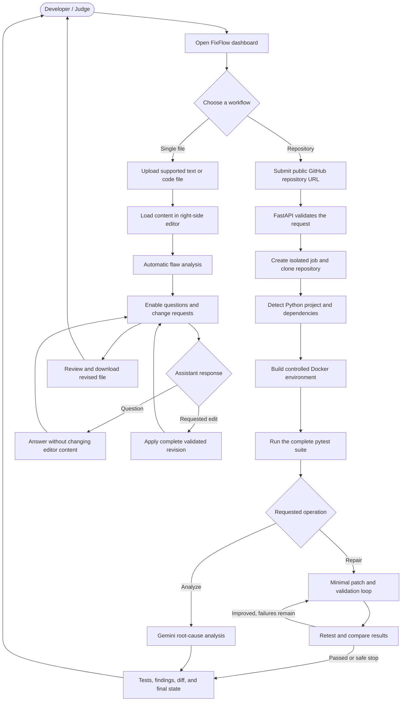

# FixFlow

FixFlow is a backend service for diagnosing and autonomously repairing failing
tests in public Python repositories. Give it a GitHub repository URL and it
creates an isolated job, runs the complete pytest suite in Docker, asks Gemini
to understand the failures, and optionally applies and validates minimal source
patches.

FixFlow never pushes changes, creates commits, or modifies the remote GitHub
repository. Every proposed repair remains as an inspectable, uncommitted diff
inside that job's local workspace.

## What the application does

FixFlow exposes two repository workflows and a focused file workspace:

- **Analyze** runs the repository's tests and returns structured root-cause
  analysis for every failure without changing source files.
- **Repair** runs the same analysis, asks Gemini for bounded unified-diff
  changes, retests the entire suite, rolls back regressions, and reflects on
  remaining failures until the tests pass or a safe stop condition is reached.
- **File workspace** opens an uploaded text/code file in the right-side editor,
  performs a flaw analysis before enabling chat, applies only explicitly
  requested edits, and lets the user download the revised browser copy.

Repository analysis and repair support public Python repositories hosted on
GitHub. The file workspace accepts the supported text and source-code formats
shown in the upload panel and never executes uploaded content.

## Application flow

### End-to-end user flow



The repository workflow executes untrusted project code only inside Docker.
The single-file workflow treats uploaded content as text, sends it to Gemini for
review or revision, and keeps the working copy in the browser.

## Architecture

```mermaid
flowchart LR
    subgraph CLIENT[Browser client]
        DASH[Dashboard<br/>HTML, CSS, JavaScript]
        REPOUI[Repository form<br/>progress and report]
        FILEUI[Right-side file editor<br/>analysis and chat]
        APIUSER[API client or interactive docs]
        DASH --> REPOUI
        DASH --> FILEUI
    end

    subgraph API[FastAPI application]
        MAIN[App entry point<br/>static UI and error handling]
        AR[Analysis router<br/>POST /api/analyze]
        RR[Repair router<br/>POST /api/repair]
        FR[File router<br/>POST /api/file/analyze<br/>POST /api/file/assist]
        MAIN --> AR
        MAIN --> RR
        MAIN --> FR
    end

    subgraph REPOSITORY[Repository pipeline]
        RS[Repository service]
        PD[Python detector]
        DS[Docker service]
        PS[pytest and JUnit parser]
        AS[Analysis service]
        RPS[Repair service and agent]
        TOOLS[Bounded repository tools]
        RUNNER[Docker test runner]

        RS --> PD --> DS --> PS --> AS
        AS --> RPS
        RPS --> TOOLS
        RPS --> RUNNER
        RUNNER --> DS
    end

    subgraph FILE[Single-file pipeline]
        FWS[File workspace service]
        VALIDATE[Name, type, text, and size validation]
        GUARD[Answer/edit response guard]
        FWS --> VALIDATE
    end

    subgraph EXTERNAL[External and isolated systems]
        GH[(Public GitHub)]
        GEMINI[Gemini API<br/>primary and fallback models]
        ENGINE[Docker engine<br/>network-disabled test container]
        WORKSPACE[(Per-job workspace<br/>repository, JUnit, diff)]
    end

    REPOUI -->|JSON over HTTP| AR
    APIUSER -->|JSON over HTTP| RR
    FILEUI -->|File text and prompt over HTTP| FR
    AR --> RS
    RR --> RS
    RR --> RPS
    FR --> FWS
    RS --> GH
    RS --> WORKSPACE
    TOOLS --> WORKSPACE
    DS --> ENGINE
    AS --> GEMINI
    RPS --> GEMINI
    VALIDATE -->|Safe untrusted text| GEMINI
    GEMINI -->|Structured file response| GUARD
    GUARD --> FWS
    AR -->|Structured result| REPOUI
    RR -->|Validated diff and test state| REPOUI
    FR -->|Flaws, answer, or revised content| FILEUI
```



The current dashboard uses synchronous HTTP requests. Repository source is
cloned into a per-job workspace; tests run in a network-disabled Docker
container; Gemini receives bounded context; and no workflow pushes to the
remote repository. The file workspace does not write uploads into a repository
or server-side job workspace.

### Repository analysis

```text
GitHub repository URL
        |
        v
Create isolated job workspace
        |
        v
Clone repository and detect Python project
        |
        v
Generate controlled Docker environment
        |
        v
Install dependencies and run complete pytest suite
        |
        v
Read authoritative counts from JUnit XML
        |
        v
Collect failure names, messages, and traces from pytest output
        |
        v
Select relevant tests and source files
        |
        v
Gemini root-cause analysis
        |
        v
Structured API response
```

### Autonomous repair

```text
Initial analysis
        |
        v
Gemini proposes minimal unified diffs
        |
        v
Validate paths, file types, patch size, and patch structure
        |
        v
Apply changes transactionally inside the job repository
        |
        v
Rebuild and run the complete pytest suite in Docker
        |
        v
Compare previous and current results
        |
        +-- tests pass -----> Complete
        |
        +-- result better --> Reflect and continue
        |
        +-- regression -----> Restore exact pre-iteration files,
                              then request a different repair
```

The loop stops when all tests pass, the configured iteration limit is reached,
Gemini remains unavailable after retries and fallback, or a proposed change is
unsafe.

## Job workspace

Each request receives a unique job ID and uses this layout:

```text
workspaces/<job-id>/
|-- repository/                  cloned repository and accepted working changes
|-- artifacts/junit.xml         pytest result counts
|-- FixFlow.Dockerfile           generated test environment
`-- FixFlow.Dockerfile.dockerignore
```

The Docker and artifact files stay outside `repository/`, so they cannot affect
Git diffs or modified-file tracking. Cloned code is never imported or executed
directly by the FixFlow host; dependency installation and pytest run in Docker.

## Prerequisites

- Python 3.10 or newer
- Git on `PATH`
- Docker CLI with a running Linux-container Docker daemon
- A Google Gemini API key

## Setup

From the `FixFlow` directory on Windows PowerShell:

```powershell
python -m venv .venv
.\.venv\Scripts\python.exe -m pip install -r requirements.txt
Copy-Item .env.example .env
```

From WSL/Linux:

```bash
python3 -m venv .venv-wsl
source .venv-wsl/bin/activate
python -m pip install -r requirements.txt
cp .env.example .env
```

Set `GEMINI_API_KEY` in `.env`. FixFlow loads the project-level file once when
its central configuration module initializes. Existing process environment
variables take precedence over values from `.env`.

`GEMINI_MODEL_PRIMARY` selects the normal Gemini model and
`GEMINI_MODEL_FALLBACK` optionally selects a second model. Temporary provider
failures exhaust bounded retries on the primary before the shared Gemini client
switches to the fallback. An empty fallback keeps single-model behavior.

You may still override the value for one PowerShell session when needed:

```powershell
$env:GEMINI_API_KEY = "your-api-key"
```

Never commit the key; `.env` is ignored.

## Run in development

From WSL/Linux, restrict reload watching to the application source directory:

```bash
source .venv-wsl/bin/activate
uvicorn app.main:app --reload --reload-dir app
```

Do not use an unrestricted `--reload` from the FixFlow root. Analysis clones
Python files into `workspaces/`, and watching that directory can restart the
server while `/api/analyze` is still running.

For production or a stable local run, disable reload entirely:

```bash
uvicorn app.main:app
```

On Windows PowerShell, the equivalent development command is:

```powershell
.\.venv\Scripts\uvicorn.exe app.main:app --reload --reload-dir app
```

## Use the application

- Dashboard: `http://127.0.0.1:8000/`
- Interactive API documentation: `http://127.0.0.1:8000/docs`
- Health check: `GET http://127.0.0.1:8000/health`

The dashboard is plain HTML, CSS, and JavaScript served by FastAPI. It has no
Node dependency, build step, or separate frontend process.

### Analyze a repository

Send a public GitHub URL to `POST /api/analyze`:

```powershell
$body = @{ repository_url = "https://github.com/user/project.git" } | ConvertTo-Json
Invoke-RestMethod -Method Post -Uri "http://127.0.0.1:8000/api/analyze" -ContentType "application/json" -Body $body
```

The analysis endpoint never changes repository files. Its status is one of:

- `issues_found`: tests failed and Gemini returned structured analysis.
- `tests_passed`: all collected tests passed, so Gemini was not called.
- `no_tests`: pytest collected no tests.
- `analysis_failed`: test results are available, but AI analysis was unavailable
  or invalid.

### Repair a repository

Send the same request shape to `POST /api/repair`:

```powershell
$body = @{ repository_url = "https://github.com/user/buggy-project.git" } | ConvertTo-Json
Invoke-RestMethod -Method Post -Uri "http://127.0.0.1:8000/api/repair" -ContentType "application/json" -Body $body
```

Repair status values are:

- `fixed`: every collected test passes after one or more accepted changes.
- `already_passing`: the initial suite passed and no repair was needed.
- `partial`: the iteration limit was reached with failures remaining.
- `unsafe_change`: a proposed path or patch failed safety validation.
- `gemini_unavailable`: primary and configured fallback attempts were exhausted.
- `no_tests`: pytest collected no tests, so no repair was attempted.

The response includes the initial commit and Git state, initial and final test
results, every repair attempt, comparison classifications, accepted and rejected
changes, modified files, additions, deletions, and the final uncommitted diff.

Requests are synchronous: the HTTP request remains open while cloning, building,
testing, analyzing, and—when requested—repairing the repository.

## Test results and comparison

Every Docker test run executes the complete suite with verbose output and writes
JUnit XML to the job's external artifact directory. JUnit XML is the source of
truth for total, passed, failed, skipped, and error counts. Raw stdout and stderr
are retained for test identifiers, assertion messages, source locations, and
tracebacks, so values such as HTTP status code `404` cannot corrupt statistics.

After a repair, FixFlow classifies the result as:

- `passed`: no failures or errors remain.
- `improved`: fewer failures/errors, or more passing tests without regressions.
- `unchanged`: the outcome did not improve or worsen.
- `regressed`: failures increased, passing tests decreased, tests disappeared,
  or pytest could not produce a valid result.

Regressed changes are rejected and restored byte-for-byte before reflection.

## Gemini reliability

The shared Gemini client is used for root-cause analysis, repair generation, and
reflection. It retries temporary failures with exponential backoff, then switches
from `GEMINI_MODEL_PRIMARY` to `GEMINI_MODEL_FALLBACK` when configured. HTTP
429/500/503/504 responses, request timeouts, and temporary network errors are
eligible. Permanent request and authentication errors fail immediately.

Gemini retries never rerun cloning, Docker builds, dependency installation, or
pytest. Previously captured test results and source context are reused.

## Main components

- `app/api/` defines the analysis and repair HTTP endpoints.
- `app/services/repository_service.py` validates GitHub URLs and creates jobs.
- `app/services/docker_service.py` builds the controlled Python environment and
  runs pytest with resource and security limits.
- `app/services/pytest_service.py` parses JUnit counts and raw failure details.
- `app/services/analysis_service.py` selects relevant code for diagnosis.
- `app/llm/gemini_client.py` owns Gemini requests, retries, and model fallback.
- `app/agent/repair_agent.py` creates structured repair and reflection prompts.
- `app/tools/repository_tools.py` validates and applies transactional patches.
- `app/services/repair_service.py` manages comparison, rollback, and iteration.

## Configuration

Execution limits can be changed with environment variables. Common settings are:

- `MAX_ITERATIONS` — maximum autonomous repair attempts; default `5`.
- `MAX_FILES_PER_ITERATION` — maximum files in one repair proposal.
- `MAX_PATCH_CHARACTERS` — maximum combined patch size per iteration.
- `GEMINI_MAX_RETRIES` — retries allowed for each configured Gemini model.
- `GEMINI_RETRY_BACKOFF_SECONDS` — base exponential-backoff delay.
- `DOCKER_RUN_TIMEOUT_SECONDS`, `DOCKER_MEMORY`, `DOCKER_CPUS`, and
  `DOCKER_PIDS_LIMIT` — test execution boundaries.

See `.env.example` for a ready-to-copy configuration template.

## Error behavior

Clone failures, unsupported repositories, Docker failures, dependency build
failures, missing pytest, invalid JUnit results, timeouts, and Gemini failures
produce structured errors or partial responses without discarding completed test
results. Job workspaces remain available for inspection, while generated Docker
images and timed-out containers are cleaned up.

Docker startup errors are deliberately distinct:

- `docker_cli_unavailable`: no Docker executable was found on `PATH`.
- `docker_daemon_unavailable`: the CLI exists but cannot reach the daemon.
- `docker_execution_failed`: pulling, building, or starting the container failed.
- `docker_timeout`: a bounded Docker operation exceeded its timeout.

## Security boundaries

- Only public HTTPS `github.com/owner/repository` URLs are accepted.
- Git prompts, Git LFS downloads, and local/file Git protocols are disabled.
- Existing repository Dockerfiles are ignored; FixFlow generates its own.
- Tests run without network access, with bounded CPU, memory, and process counts,
  all Linux capabilities dropped, and `no-new-privileges` enabled.
- Cloned code is copied into an ephemeral image and never host-executed.
- Gemini receives a bounded, traceback-driven selection of relevant files and
  never receives unrestricted shell access.
- All file tools are confined to `workspaces/<job-id>/repository/`.
- Absolute paths, traversal, symlinks, binary patches, file creation/deletion,
  renames, mode changes, oversized patches, and excessive file counts are
  rejected.
- FixFlow never commits, pushes, or opens a pull request.

## Run the test suite

```powershell
.\.venv\Scripts\pytest.exe -v
```

From WSL/Linux:

```bash
source .venv-wsl/bin/activate
pytest -v
```

Tests mock remote GitHub cloning, Docker execution, and Gemini requests. Patch
and rollback tests use temporary local Git repositories to verify real unified
diff application and exact restoration without contacting GitHub or Docker.

## Scope and limitations

FixFlow supports Python repositories and pytest. It does not currently support
JavaScript/TypeScript or Java projects, ZIP generation, GitHub push, automatic
pull requests, Ruff, or Bandit integration.
